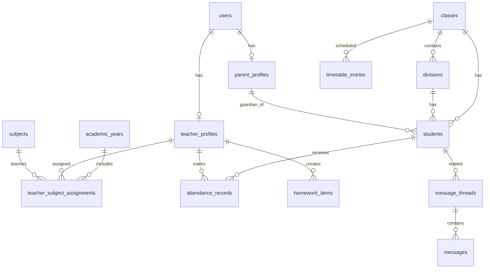
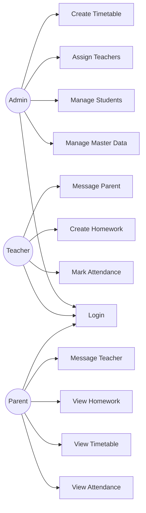
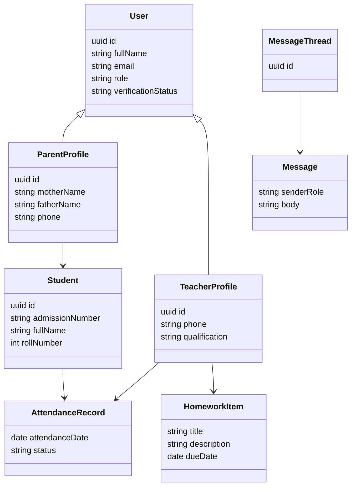
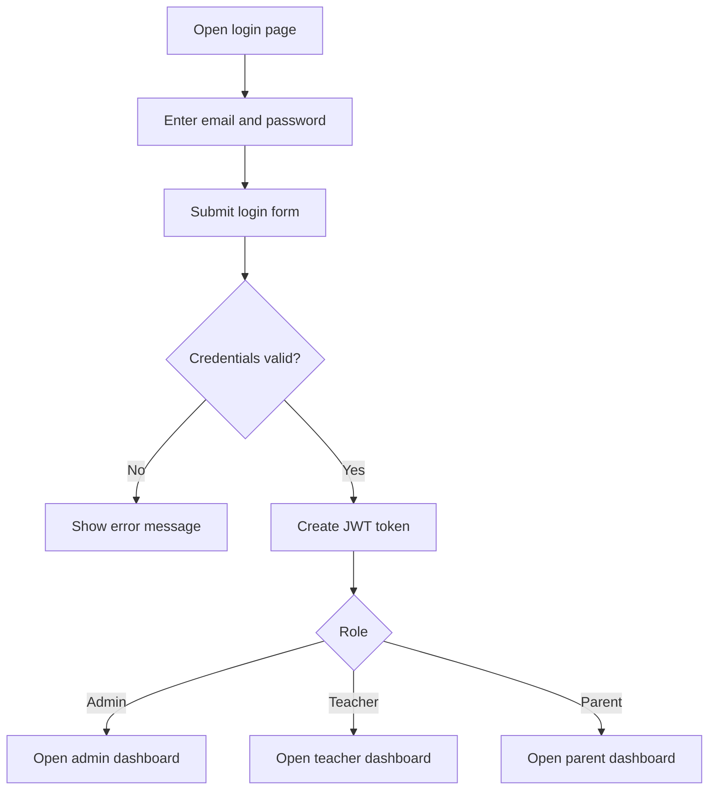
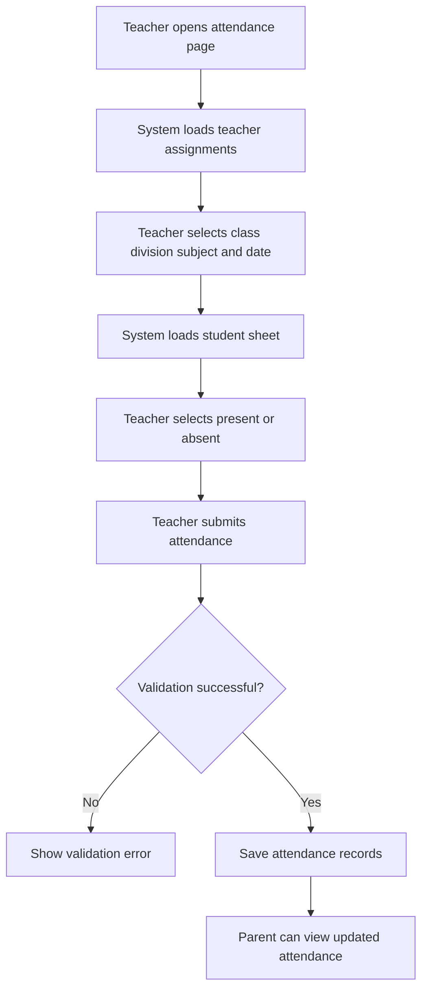
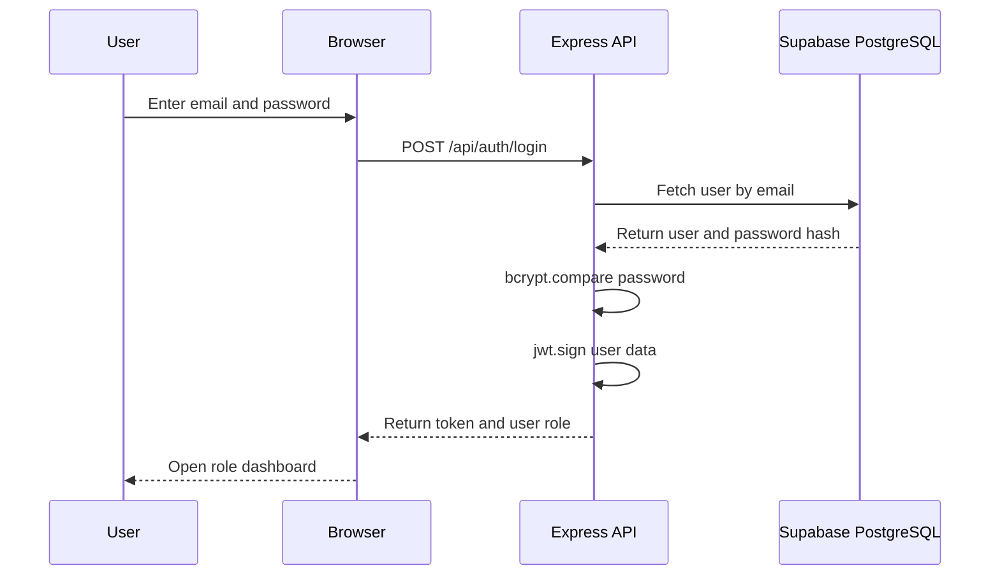
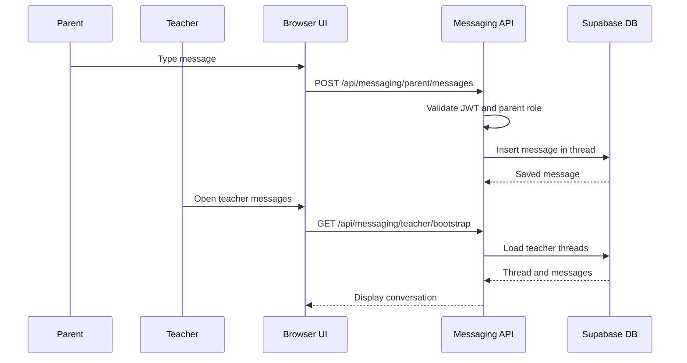
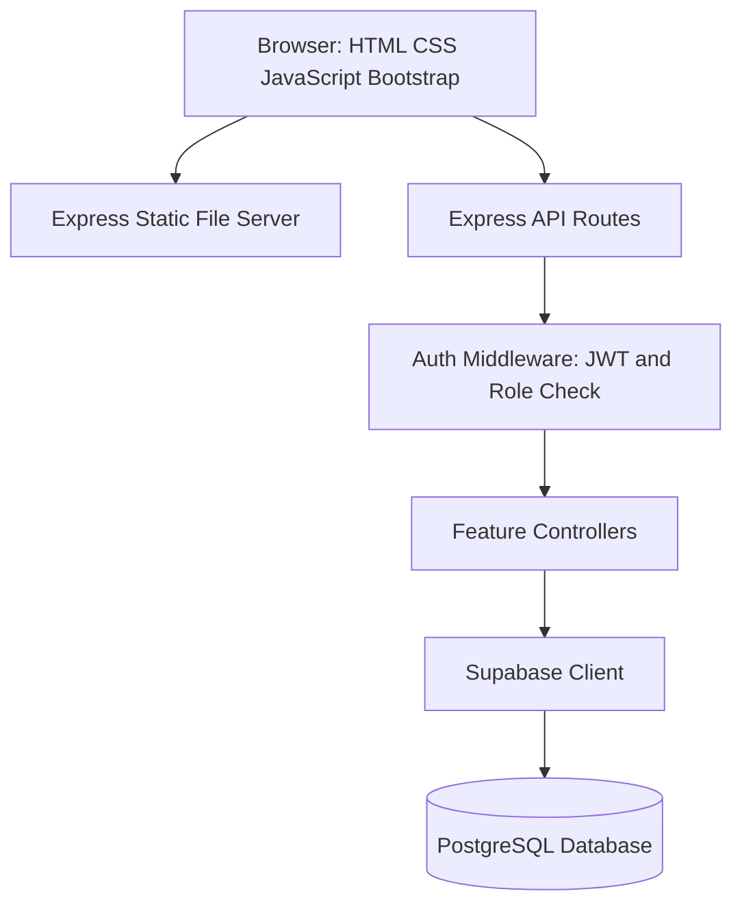

# EduNexus Academic - 70 Page Project Report

## Page 1: Title Page

# EduNexus Academic

## A Parent-Teacher Communication Platform for Complete School Management

**Project Report**

**Project Type:** Full Stack Web Application  
**Frontend:** HTML, CSS, JavaScript, Bootstrap  
**Backend:** Node.js, Express.js  
**Database:** Supabase PostgreSQL  
**Authentication:** JWT with bcrypt password verification  
**Prepared For:** Academic Submission

EduNexus Academic is a full stack parent-teacher communication platform developed for a complete school environment. The project uses HTML, CSS, JavaScript and Bootstrap on the frontend, Node.js and Express.js on the backend, and Supabase PostgreSQL as the database layer. The system supports Admin, Teacher and Parent roles with different dashboards and controlled access to school information.

This report documents the system introduction, proposed solution, analysis and design, input and output screens, code snippets, testing, limitations, enhancements, conclusion and bibliography according to the required academic report format.

---

## Page 2: Certificate

This is to certify that the project titled **EduNexus Academic** has been prepared as an academic full stack web application project. The project demonstrates the use of modern web technologies for solving a practical school communication problem.

The application includes secure login, role-based dashboards, school master data management, attendance, timetable, homework, parent-teacher messaging, and parent verification status. The project has been implemented using Node.js, Express.js and Supabase PostgreSQL with a responsive HTML, CSS, JavaScript and Bootstrap frontend.

The work described in this report is suitable for presentation as a software engineering project because it covers requirements, analysis, design, implementation and testing.

---

## Page 3: Declaration

I hereby declare that the project report titled **EduNexus Academic** is prepared for academic and learning purposes. The report is based on the implemented project files, database scripts, frontend screens and backend API modules present in the project directory.

The system has been developed to address communication and academic coordination challenges between schools, teachers and parents. All major modules have been studied and documented in a structured manner.

The report presents the project honestly as a working web application with current limitations and future enhancement possibilities.

---

## Page 4: Acknowledgement

The successful completion of this project was supported by the availability of open web technologies, development tools and educational resources. HTML, CSS, JavaScript, Bootstrap, Node.js, Express.js and PostgreSQL provide a strong foundation for creating practical web applications.

Supabase has been used as the PostgreSQL-backed database service for structured persistence. The project also uses common backend packages such as bcryptjs, jsonwebtoken, cors, dotenv and morgan.

This report acknowledges the importance of school communication systems and the value of software that improves transparency, accountability and information flow in academic institutions.

---

## Page 5: Index

# Index

| Sr. No. | Content | Page no. |
|---:|---|---:|
| 1 | INTRODUCTION | 6 - 15 |
| 2 | PROPOSED SYSTEM | 16 - 21 |
| 3 | ANALYSIS & DESIGN | 22 - 40 |
| 4 | INPUT SCREENS WITH DATA | 41 - 48 |
| 5 | OUTPUT SCREENS WITH DATA | 49 - 54 |
| 6 | CODE SNIPPETS | 55 - 60 |
| 7 | TESTING (TEST CASES) | 61 - 65 |
| 8 | LIMITATIONS OF PROPOSED SYSTEM | 66 |
| 9 | PROPOSED ENHANCEMENT | 67 |
| 10 | CONCLUSION | 68 |
| 11 | BIBLIOGRAPHY | 69 - 70 |

The following pages follow the required academic format. The report uses page markers so that it can be converted to PDF or printed with controlled page breaks if needed.

---

## Page 6: Introduction

# 1. INTRODUCTION

EduNexus Academic is a full stack parent-teacher communication platform developed for a complete school environment. The project uses HTML, CSS, JavaScript and Bootstrap on the frontend, Node.js and Express.js on the backend, and Supabase PostgreSQL as the database layer. The system supports Admin, Teacher and Parent roles with different dashboards and controlled access to school information.

Schools handle many daily academic activities: student admission, class and division management, teacher assignment, attendance, homework, timetable sharing and parent communication. In a manual system these activities are scattered across notebooks, registers, spreadsheets, printed notices and informal messages. EduNexus Academic brings these activities into a central web application.

The system is role based. Admin users manage school data. Teacher users mark attendance, assign homework and communicate with parents. Parent users view their child's academic updates and send messages to assigned teachers. This separation improves clarity and prevents users from accessing unrelated information.

---

## Page 7: 1.1 Company Profile

## 1.1 Company Profile

For this academic project, the assumed organization is **EduNexus Academic School Management Services**, a digital school administration initiative focused on improving communication between schools and families. The organization works with educational institutions that need a simple, reliable and structured platform for academic operations.

| Field | Details |
|---|---|
| Organization Name | EduNexus Academic School Management Services |
| Domain | Education Technology |
| Main Users | School administrators, teachers and parents |
| Primary Objective | Improve academic communication and record visibility |
| Service Type | Web-based school communication and management platform |

The project supports the organization's goal of reducing manual communication gaps and improving access to academic data.

---

## Page 8: 1.2 Abstract

## 1.2 Abstract

EduNexus Academic is a full stack web application designed to improve communication and academic coordination among administrators, teachers and parents. The system gives every user a secure login and displays a dashboard based on the user's role.

The Admin can maintain academic years, classes, divisions, subjects, students, parent records, teacher records, teacher-subject assignments and timetables. Teachers can mark attendance, create homework and exchange messages with parents. Parents can view attendance percentage, attendance history, timetable, homework and messages related only to their own child.

The backend is implemented using Node.js and Express.js. Supabase PostgreSQL stores the relational data. JWT tokens are used for session authentication, and passwords are verified using bcrypt. The frontend is built with HTML, CSS, JavaScript and Bootstrap so that it remains lightweight and responsive.

---

## Page 9: 1.3 Existing System

## 1.3 Existing System

In many schools, communication between school staff and parents still depends on manual or semi-digital methods. Attendance may be maintained in physical registers. Homework may be written on the classroom board or shared through messaging groups. Timetable updates may be circulated through printed notices. Parent-teacher communication may happen through diaries, calls or unstructured chat groups.

The existing approach has the following problems:

- Parents may not receive updates on time.
- Teachers repeat the same message to many parents.
- Attendance history is difficult to summarize quickly.
- Admins must manage class, subject and teacher mappings manually.
- Communication records are difficult to audit.
- Parent identity and access control are weak in informal channels.

These limitations show the need for a central role-based web system.

---

## Page 10: 1.4 Scope of System

## 1.4 Scope of System

The scope of EduNexus Academic includes the main academic communication activities required by a school operating with classes and divisions. The project is not intended to replace every possible ERP feature, but it covers the core functions needed for daily parent-teacher coordination.

Included scope:

- Secure login for Admin, Teacher and Parent.
- Role-based dashboards.
- Class and division management.
- Class-wise subject mapping.
- Student admission and parent linking.
- Teacher profile and teacher assignment management.
- Daily attendance marking by teachers.
- Attendance overview for parents.
- Timetable creation by admin and viewing by parents.
- Homework assignment by teachers and viewing by parents.
- Parent-teacher messaging.

---

## Page 11: 1.5 Operating Environment HW/SW

## 1.5 Operating Environment-HW/SW

| Component | Minimum Requirement | Recommended Requirement |
|---|---|---|
| Processor | Dual-core processor | Quad-core processor or better |
| RAM | 4 GB | 8 GB or above |
| Storage | 500 MB free space | 1 GB or above |
| Network | Internet or local network | Stable broadband connection |

| Software | Purpose |
|---|---|
| Windows / Linux / macOS | Operating system |
| Node.js | Backend runtime |
| npm | Package manager |
| Browser | Frontend access |
| Supabase | PostgreSQL database service |
| VS Code | Development editor |

---

## Page 12: 1.6 Technology Used

## 1.6 Technology Used

| Technology | Usage in Project |
|---|---|
| HTML | Page structure and forms |
| CSS | Styling and responsive layout |
| JavaScript | Frontend behavior and API calls |
| Bootstrap | Ready-made responsive UI components |
| Node.js | Runtime environment for backend |
| Express.js | API routing and server handling |
| Supabase PostgreSQL | Relational database storage |
| bcryptjs | Password hash verification |
| jsonwebtoken | JWT token creation and verification |
| dotenv | Environment variable management |
| cors | Cross-origin request support |
| morgan | Development request logging |

---

## Page 13: Module Overview

## 1.7 Module Overview

The system is divided into modules so that each responsibility remains clear. The authentication module manages login and current user details. The admin module manages master data. The attendance module handles class-wise attendance entry and parent attendance reports. The timetable module stores weekly schedules. The homework module stores assignments with due dates. The messaging module supports structured communication threads.

The modular structure improves maintainability because routes and controllers are separated by feature. For example, attendance-related APIs are placed in attendance routes and attendance controllers, while timetable-related logic is placed in timetable routes and timetable controllers.

---

## Page 14: Project Folder Structure

## 1.8 Project Folder Structure

```text
Parent-Student
|-- database
|   |-- 001_auth_schema.sql
|   |-- 002_school_master_schema.sql
|   |-- 003_attendance_schema.sql
|   |-- 004_timetable_homework_schema.sql
|   |-- 005_messaging_schema.sql
|   |-- 006_parent_admission_fields.sql
|   |-- 007_remove_parent_name.sql
|   |-- 008_class_wise_subjects.sql
|-- public
|   |-- index.html
|   |-- css/styles.css
|   |-- js/*.js
|   |-- pages/*.html
|-- server
|   |-- config/supabase.js
|   |-- controllers/*.js
|   |-- middleware/authMiddleware.js
|   |-- routes/*.js
|-- package.json
|-- README.md
```

This structure separates SQL migrations, browser files and server-side application code.

---

## Page 15: Need and Importance

## 1.9 Need and Importance

EduNexus Academic is important because school communication requires trust, speed and clarity. A parent should be able to know whether attendance was marked, what homework was assigned and which teacher has sent a message. A teacher should be able to communicate through a structured system instead of depending on scattered informal channels.

The system improves academic administration by centralizing student-related information, preserving communication records, reducing repeated manual communication, supporting class-wise organization and preparing the school for future digital expansion.

---

## Page 16: Proposed System

# 2. PROPOSED SYSTEM

The proposed system is a centralized web-based school communication platform. It replaces scattered manual communication with a structured role-based application. Each user logs in with an email and password. After login, the system identifies the role and redirects the user to the correct dashboard.

The Admin dashboard provides master data operations. The Teacher dashboard provides academic work operations such as attendance, homework and messaging. The Parent dashboard provides visibility into the linked student's attendance, timetable, homework and messages.

---

## Page 17: 2.1 Feasibility Study

## 2.1 Feasibility Study

### Technical Feasibility

The project uses Node.js, Express.js, Supabase PostgreSQL, HTML, CSS, JavaScript and Bootstrap. These technologies are stable and well documented.

### Operational Feasibility

The system is easy for school users because each role has separate pages. Admins manage data, teachers work with class assignments, and parents only view child-related information.

### Economic Feasibility

The project can be developed with open-source tools. Supabase provides a managed PostgreSQL backend, reducing database setup effort during development.

---

## Page 18: Feasibility Details

## 2.1.1 Feasibility Details

### Schedule Feasibility

The system is divided into independent modules. This makes it possible to develop the project step by step: authentication first, then master data, then attendance, timetable, homework and messaging.

### Legal Feasibility

The current project uses demo data and academic sample users. In a real school deployment, legal feasibility would require compliance with student data privacy rules and secure database policies.

### Resource Feasibility

A standard laptop, Node.js, a browser and a Supabase account are enough for development and testing.

---

## Page 19: 2.2 Objective of Proposed System

## 2.2 Objective of Proposed System

- To provide a secure login system for all users.
- To support Admin, Teacher and Parent role separation.
- To help admins manage classes, divisions, subjects, teachers, parents and students.
- To allow class-wise curriculum subject mapping.
- To allow teachers to mark daily attendance.
- To allow parents to view attendance percentage and history.
- To allow admins to create timetables.
- To allow parents to view timetables for linked students.
- To allow teachers to assign homework with due dates.
- To provide parent-teacher messaging through structured threads.

---

## Page 20: Advantages of Proposed System

## 2.3 Advantages of Proposed System

| Area | Advantage |
|---|---|
| Communication | Messages are structured by student, parent, teacher and subject. |
| Attendance | Teachers can mark attendance digitally and parents can view summaries. |
| Homework | Homework is stored with title, description, assigned date and due date. |
| Timetable | Timetable entries are class-wise and division-wise. |
| Security | JWT authentication and role checks protect backend APIs. |
| Management | Admin has a central place to maintain school master data. |
| Scalability | Modular routes and controllers support future features. |

---

## Page 21: System Users and Responsibilities

## 2.4 System Users and Responsibilities

| User | Main Responsibilities |
|---|---|
| Admin | Manage classes, divisions, subjects, students, parents, teachers, assignments and timetable. |
| Teacher | View assigned classes, mark attendance, create homework and communicate with parents. |
| Parent | View child attendance, timetable, homework and messages. |

The role-based design keeps the system simple and protects school information from unnecessary exposure.

---

## Page 22: Analysis and Design

# 3. ANALYSIS & DESIGN

Analysis and design explain how the system requirements are converted into a working solution. EduNexus Academic follows a client-server architecture. The browser sends requests to Express.js APIs. The backend validates JWT tokens, checks user roles and communicates with Supabase PostgreSQL.

---

## Page 23: 3.1 SRS Introduction

## 3.1 SRS

### Purpose

The purpose of the Software Requirements Specification is to describe the functional and non-functional requirements of EduNexus Academic.

### Product Scope

The product is a web-based academic communication system for schools. It helps administrators maintain master data, teachers perform academic tasks and parents view student-related information.

### Intended Users

- School administrators.
- Teachers.
- Parents or guardians.
- Academic evaluators reviewing the project.

---

## Page 24: 3.1 Functional Requirements

## 3.1.1 Functional Requirements

| ID | Requirement | User |
|---|---|---|
| FR-01 | User can log in using email and password. | All |
| FR-02 | System redirects user based on role. | All |
| FR-03 | Admin can manage classes and divisions. | Admin |
| FR-04 | Admin can manage class-wise subjects. | Admin |
| FR-05 | Admin can create student records and link parent accounts. | Admin |
| FR-06 | Admin can assign teachers to class, division and subject. | Admin |
| FR-07 | Teacher can view assigned classes. | Teacher |
| FR-08 | Teacher can mark attendance. | Teacher |
| FR-09 | Teacher can create homework. | Teacher |
| FR-10 | Parent can view attendance overview. | Parent |
| FR-11 | Parent can view timetable and homework. | Parent |
| FR-12 | Parent and teacher can exchange messages. | Parent/Teacher |

---

## Page 25: 3.1 Non Functional Requirements

## 3.1.2 Non-Functional Requirements

| Requirement Type | Description |
|---|---|
| Security | APIs must validate JWT token and role before giving access. |
| Usability | Interface must be simple for school users. |
| Maintainability | Backend must be organized into routes, controllers and middleware. |
| Reliability | Important database constraints must prevent duplicate or invalid records. |
| Performance | Common lookups should use indexes for faster queries. |
| Portability | Application should run on any system with Node.js and browser support. |
| Responsiveness | Pages should work on desktop and mobile screen sizes. |

---

## Page 26: 3.2 ERD

## 3.2 ERD



---

## Page 27: 3.3 Table Structure Overview

## 3.3 Table Structure

| Table | Purpose |
|---|---|
| users | Stores login users with role and verification status. |
| academic_years | Stores academic session data. |
| classes | Stores school class records. |
| divisions | Stores divisions linked with classes. |
| subjects | Stores subject names and codes. |
| class_subjects | Maps subjects to classes. |
| parent_profiles | Stores parent details linked to user accounts. |
| teacher_profiles | Stores teacher details linked to user accounts. |
| students | Stores student admission data. |
| teacher_subject_assignments | Maps teacher, subject, class, division and academic year. |
| attendance_records | Stores student attendance by date. |
| timetable_entries | Stores weekly timetable periods. |
| homework_items | Stores homework assignments. |
| message_threads | Stores parent-teacher-student conversation context. |
| messages | Stores individual chat messages. |

---

## Page 28: Users Table

## 3.3.1 Users Table

| Column | Type | Description |
|---|---|---|
| id | uuid | Primary key |
| full_name | text | Name of the user |
| email | text | Unique login email |
| password_hash | text | bcrypt hashed password |
| role | user_role | admin, teacher or parent |
| verification_status | verification_status | verified or not_verified |
| created_at | timestamptz | Record creation time |

The users table is the base identity table. Parent and teacher profile tables reference this table.

---

## Page 29: School Master Tables

## 3.3.2 School Master Tables

| Table | Important Fields | Description |
|---|---|---|
| academic_years | name, start_date, end_date, is_active | Stores academic sessions. |
| classes | name, sort_order | Stores class levels. |
| divisions | class_id, name | Stores class divisions. |
| subjects | name, code | Stores subjects. |
| class_subjects | class_id, subject_id | Maps curriculum subjects to classes. |

---

## Page 30: Profile and Student Tables

## 3.3.3 Profile and Student Tables

| Table | Important Fields | Description |
|---|---|---|
| parent_profiles | user_id, mother_name, father_name, phone, address | Stores guardian details. |
| teacher_profiles | user_id, phone, qualification | Stores teacher details. |
| students | admission_number, full_name, roll_number, class_id, division_id, parent_id, date_of_birth | Stores student admission data. |

---

## Page 31: Academic Activity Tables

## 3.3.4 Academic Activity Tables

| Table | Important Fields | Description |
|---|---|---|
| teacher_subject_assignments | academic_year_id, teacher_id, class_id, division_id, subject_id | Defines which teacher handles a subject. |
| attendance_records | attendance_date, student_id, class_id, division_id, subject_id, teacher_id, status | Stores daily attendance. |
| timetable_entries | weekday, period_number, start_time, end_time, room_label | Stores period schedule. |
| homework_items | title, description, assigned_date, due_date | Stores homework assignments. |

---

## Page 32: Messaging Tables

## 3.3.5 Messaging Tables

| Table | Important Fields | Description |
|---|---|---|
| message_threads | student_id, parent_id, teacher_id, subject_id | Stores unique conversation context. |
| messages | thread_id, sender_role, sender_parent_id, sender_teacher_id, body, created_at | Stores individual chat messages. |

---

## Page 33: 3.4 Use Case Diagram

## 3.4 Use Case Diagram



---

## Page 34: Use Case Description

## 3.4.1 Use Case Description

| Use Case | Actor | Description |
|---|---|---|
| Login | Admin, Teacher, Parent | User enters email and password. |
| Manage Master Data | Admin | Admin adds or removes classes, divisions and subjects. |
| Manage Students | Admin | Admin creates student records and links parents. |
| Assign Teachers | Admin | Admin maps teacher to subject, class and division. |
| Create Timetable | Admin | Admin creates period entries. |
| Mark Attendance | Teacher | Teacher marks present or absent status. |
| Create Homework | Teacher | Teacher creates homework for assigned class. |
| View Academic Data | Parent | Parent views attendance, timetable and homework. |
| Messaging | Teacher/Parent | Parent and teacher exchange messages. |

---

## Page 35: 3.5 Class Diagram

## 3.5 Class Diagram



---

## Page 36: 3.6 Activity Diagram Login

## 3.6 Activity Diagram - Login



---

## Page 37: 3.6 Activity Diagram Attendance

## 3.6 Activity Diagram - Attendance



---

## Page 38: 3.7 Sequence Diagram Login

## 3.7 Sequence Diagram - Login



---

## Page 39: 3.7 Sequence Diagram Messaging

## 3.7 Sequence Diagram - Messaging



---

## Page 40: System Architecture

## 3.8 System Architecture



The architecture separates presentation, API routing, authentication, business logic and data storage.

---

## Page 41: 4.1 Login Screen Input

# 4. INPUT SCREENS WITH DATA

## Login Screen Input

| Field | Sample Data |
|---|---|
| Email | admin@edunexus.test |
| Password | Password@123 |

Validation is important on this screen because incorrect input can affect linked academic records. Required fields should be checked before sending data to the backend API. After successful submission, the screen should show a success message or refresh the relevant list.

---

## Page 42: 4.2 Admin Master Data Input

# 4. INPUT SCREENS WITH DATA

## Admin Master Data Input

| Field | Sample Data |
|---|---|
| Class Name | Class 3 |
| Division | A |
| Subject | Mathematics |
| Subject Code | MATH |

Validation is important on this screen because incorrect input can affect linked academic records. Required fields should be checked before sending data to the backend API. After successful submission, the screen should show a success message or refresh the relevant list.

---

## Page 43: 4.3 Student Admission Input

# 4. INPUT SCREENS WITH DATA

## Student Admission Input

| Field | Sample Data |
|---|---|
| Admission Number | ADM-1001 |
| Student Name | Aarav Rahul |
| Roll Number | 1 |
| Class | Class 3 |
| Division | A |

Validation is important on this screen because incorrect input can affect linked academic records. Required fields should be checked before sending data to the backend API. After successful submission, the screen should show a success message or refresh the relevant list.

---

## Page 44: 4.4 Teacher Assignment Input

# 4. INPUT SCREENS WITH DATA

## Teacher Assignment Input

| Field | Sample Data |
|---|---|
| Academic Year | 2026-2027 |
| Teacher | Anita Teacher |
| Subject | English |

Validation is important on this screen because incorrect input can affect linked academic records. Required fields should be checked before sending data to the backend API. After successful submission, the screen should show a success message or refresh the relevant list.

---

## Page 45: 4.5 Attendance Input

# 4. INPUT SCREENS WITH DATA

## Attendance Input

| Field | Sample Data |
|---|---|
| Date | 2026-04-25 |
| Student | Aarav Rahul |
| Status | Present |

Validation is important on this screen because incorrect input can affect linked academic records. Required fields should be checked before sending data to the backend API. After successful submission, the screen should show a success message or refresh the relevant list.

---

## Page 46: 4.6 Timetable Input

# 4. INPUT SCREENS WITH DATA

## Timetable Input

| Field | Sample Data |
|---|---|
| Weekday | Monday |
| Period | 1 |
| Start | 08:30 |
| End | 09:15 |

Validation is important on this screen because incorrect input can affect linked academic records. Required fields should be checked before sending data to the backend API. After successful submission, the screen should show a success message or refresh the relevant list.

---

## Page 47: 4.7 Homework Input

# 4. INPUT SCREENS WITH DATA

## Homework Input

| Field | Sample Data |
|---|---|
| Title | Reading Practice |
| Due Date | current date + 3 days |

Validation is important on this screen because incorrect input can affect linked academic records. Required fields should be checked before sending data to the backend API. After successful submission, the screen should show a success message or refresh the relevant list.

---

## Page 48: 4.8 Messaging Input

# 4. INPUT SCREENS WITH DATA

## Messaging Input

| Field | Sample Data |
|---|---|
| Thread | Aarav Rahul - English |
| Message | Please remind Aarav to bring the English notebook tomorrow. |

Validation is important on this screen because incorrect input can affect linked academic records. Required fields should be checked before sending data to the backend API. After successful submission, the screen should show a success message or refresh the relevant list.

---

## Page 49: 5.1 Admin Dashboard Output

# 5. OUTPUT SCREENS WITH DATA

## Admin Dashboard Output

Displays counts and management links for school master data, students, teachers, assignments and timetable.

| Output Area | Example Data |
|---|---|
| User | Demo role-based user |
| Student | Aarav Rahul |
| Class | Class 3-A |
| Academic Year | 2026-2027 |
| Status | Data loaded successfully |

The output screen must present data clearly and must avoid showing records that do not belong to the logged-in user.

---

## Page 50: 5.2 Teacher Dashboard Output

# 5. OUTPUT SCREENS WITH DATA

## Teacher Dashboard Output

Displays assigned academic tasks such as attendance, homework and messages.

| Output Area | Example Data |
|---|---|
| User | Demo role-based user |
| Student | Aarav Rahul |
| Class | Class 3-A |
| Academic Year | 2026-2027 |
| Status | Data loaded successfully |

The output screen must present data clearly and must avoid showing records that do not belong to the logged-in user.

---

## Page 51: 5.3 Parent Dashboard Output

# 5. OUTPUT SCREENS WITH DATA

## Parent Dashboard Output

Displays child-related attendance, timetable, homework and communication access.

| Output Area | Example Data |
|---|---|
| User | Demo role-based user |
| Student | Aarav Rahul |
| Class | Class 3-A |
| Academic Year | 2026-2027 |
| Status | Data loaded successfully |

The output screen must present data clearly and must avoid showing records that do not belong to the logged-in user.

---

## Page 52: 5.4 Attendance Report Output

# 5. OUTPUT SCREENS WITH DATA

## Attendance Report Output

Shows attendance percentage, present days, absent days and history rows.

| Output Area | Example Data |
|---|---|
| User | Demo role-based user |
| Student | Aarav Rahul |
| Class | Class 3-A |
| Academic Year | 2026-2027 |
| Status | Data loaded successfully |

The output screen must present data clearly and must avoid showing records that do not belong to the logged-in user.

---

## Page 53: 5.5 Timetable Output

# 5. OUTPUT SCREENS WITH DATA

## Timetable Output

Shows weekday-wise period list with subject, time, teacher and room.

| Output Area | Example Data |
|---|---|
| User | Demo role-based user |
| Student | Aarav Rahul |
| Class | Class 3-A |
| Academic Year | 2026-2027 |
| Status | Data loaded successfully |

The output screen must present data clearly and must avoid showing records that do not belong to the logged-in user.

---

## Page 54: 5.6 Messaging Output

# 5. OUTPUT SCREENS WITH DATA

## Messaging Output

Shows conversation thread and message history between parent and teacher.

| Output Area | Example Data |
|---|---|
| User | Demo role-based user |
| Student | Aarav Rahul |
| Class | Class 3-A |
| Academic Year | 2026-2027 |
| Status | Data loaded successfully |

The output screen must present data clearly and must avoid showing records that do not belong to the logged-in user.

---

## Page 55: 6.1 Server Setup

# 6. CODE SNIPPETS

## Server Setup

```javascript
require('dotenv').config();
const express = require('express');
const app = express();
app.use(express.json());
app.use('/api/auth', authRoutes);
app.use('/api/admin', adminRoutes);
```

This code supports the modular backend design of EduNexus Academic. The project separates routes, controllers, middleware and configuration so that each feature can be maintained independently.

---

## Page 56: 6.2 Login Controller

# 6. CODE SNIPPETS

## Login Controller

```javascript
const passwordMatches = await bcrypt.compare(password, user.password_hash);
if (!passwordMatches) {
  return res.status(401).json({ message: 'Invalid email or password.' });
}
const token = jwt.sign({ id: user.id, role: user.role }, process.env.JWT_SECRET, { expiresIn: '8h' });
```

This code supports the modular backend design of EduNexus Academic. The project separates routes, controllers, middleware and configuration so that each feature can be maintained independently.

---

## Page 57: 6.3 Role Protected Route

# 6. CODE SNIPPETS

## Role Protected Route

```javascript
router.use(authenticate, authorizeRoles('admin'));
router.get('/bootstrap', getAdminBootstrap);
router.post('/classes', createClass);
router.delete('/classes/:id', deleteClass);
```

This code supports the modular backend design of EduNexus Academic. The project separates routes, controllers, middleware and configuration so that each feature can be maintained independently.

---

## Page 58: 6.4 Attendance Route

# 6. CODE SNIPPETS

## Attendance Route

```javascript
router.get('/teacher/assignments', authenticate, authorizeRoles('teacher'), getTeacherAssignments);
router.get('/teacher/sheet', authenticate, authorizeRoles('teacher'), getTeacherAttendanceSheet);
router.post('/teacher/mark', authenticate, authorizeRoles('teacher'), saveTeacherAttendance);
```

This code supports the modular backend design of EduNexus Academic. The project separates routes, controllers, middleware and configuration so that each feature can be maintained independently.

---

## Page 59: 6.5 Database Table Snippet

# 6. CODE SNIPPETS

## Database Table Snippet

```sql
create table if not exists attendance_records (
  id uuid primary key default gen_random_uuid(),
  attendance_date date not null,
  student_id uuid not null references students(id) on delete cascade,
  status attendance_status not null,
  unique (attendance_date, student_id)
);
```

This code supports the modular backend design of EduNexus Academic. The project separates routes, controllers, middleware and configuration so that each feature can be maintained independently.

---

## Page 60: 6.6 Messaging Route

# 6. CODE SNIPPETS

## Messaging Route

```javascript
router.get('/parent/bootstrap', authenticate, authorizeRoles('parent'), getParentMessagingBootstrap);
router.post('/parent/threads', authenticate, authorizeRoles('parent'), createParentThread);
router.post('/parent/messages', authenticate, authorizeRoles('parent'), sendParentMessage);
```

This code supports the modular backend design of EduNexus Academic. The project separates routes, controllers, middleware and configuration so that each feature can be maintained independently.

---

## Page 61: 7.1 Authentication Tests

# 7. TESTING (TEST CASES)

## Authentication Tests

| Test Case ID | Test Scenario | Expected Result | Status |
|---|---|---|---|
| TC-01 | Login with valid admin credentials | Dashboard opens for admin | Pass |
| TC-02 | Login with wrong password | Error message is shown | Pass |
| TC-03 | Open protected API without token | Unauthorized response | Pass |

Testing confirms that the system behaves correctly for normal and restricted workflows. Role-based access is one of the most important test areas.

---

## Page 62: 7.2 Admin Module Tests

# 7. TESTING (TEST CASES)

## Admin Module Tests

| Test Case ID | Test Scenario | Expected Result | Status |
|---|---|---|---|
| TC-04 | Create class with valid name | Class is created | Pass |
| TC-05 | Create duplicate subject | System prevents duplicate where constraint applies | Pass |
| TC-06 | Assign teacher to subject | Assignment appears in list | Pass |

Testing confirms that the system behaves correctly for normal and restricted workflows. Role-based access is one of the most important test areas.

---

## Page 63: 7.3 Teacher Module Tests

# 7. TESTING (TEST CASES)

## Teacher Module Tests

| Test Case ID | Test Scenario | Expected Result | Status |
|---|---|---|---|
| TC-07 | Load teacher attendance sheet | Students of assigned class appear | Pass |
| TC-08 | Mark attendance | Attendance record saved | Pass |
| TC-09 | Create homework with due date | Homework appears for parent | Pass |

Testing confirms that the system behaves correctly for normal and restricted workflows. Role-based access is one of the most important test areas.

---

## Page 64: 7.4 Parent Module Tests

# 7. TESTING (TEST CASES)

## Parent Module Tests

| Test Case ID | Test Scenario | Expected Result | Status |
|---|---|---|---|
| TC-10 | Open parent attendance overview | Only linked student data appears | Pass |
| TC-11 | Open timetable | Class timetable appears | Pass |
| TC-12 | Send parent message | Message is stored in thread | Pass |

Testing confirms that the system behaves correctly for normal and restricted workflows. Role-based access is one of the most important test areas.

---

## Page 65: 7.5 Non Functional Tests

# 7. TESTING (TEST CASES)

## Non Functional Tests

| Test Case ID | Test Scenario | Expected Result | Status |
|---|---|---|---|
| TC-13 | Open pages on mobile width | Layout remains usable | Pass |
| TC-14 | Access admin API as parent | Forbidden response | Pass |
| TC-15 | Health check API | Returns status ok | Pass |

Testing confirms that the system behaves correctly for normal and restricted workflows. Role-based access is one of the most important test areas.

---

## Page 66: Limitations of Proposed System

# 8. LIMITATIONS OF PROPOSED SYSTEM

- It does not include online fee management.
- It does not include exam marks, report cards or grading.
- It does not include push notifications or SMS alerts.
- It does not include file uploads for homework attachments.
- It does not include a dedicated mobile application yet.
- Parent verification is represented by status fields and is not integrated with a real government identity platform.
- Advanced audit logging is not implemented for every operation.
- The project uses demo seed data and requires production hardening before real deployment.

These limitations do not reduce the academic value of the project, but they identify areas that can be improved in future versions.

---

## Page 67: Proposed Enhancement

# 9. PROPOSED ENHANCEMENT

- Add exam result and marksheet module.
- Add fee payment and receipt module.
- Add push notifications for homework, attendance and messages.
- Add email or SMS reminders.
- Add file upload support for homework attachments.
- Add teacher attendance and staff management.
- Add mobile application using Capacitor or another hybrid app framework.
- Add analytics dashboards for attendance trends.
- Add role management for principal, clerk and accountant roles.
- Add stronger audit logs for admin operations.
- Add real parent identity verification integration if required by the school.

These enhancements would convert the project from a communication platform into a broader school ERP system.

---

## Page 68: Conclusion

# 10. CONCLUSION

EduNexus Academic successfully demonstrates the design and implementation of a full stack parent-teacher communication platform. The project solves a practical academic problem by centralizing attendance, timetable, homework, messaging and school master data in a role-based web application.

The system uses a clean technology stack consisting of HTML, CSS, JavaScript, Bootstrap, Node.js, Express.js and Supabase PostgreSQL. JWT authentication and role-based middleware provide controlled access to backend APIs. The relational database structure supports meaningful links between users, profiles, students, classes, divisions, subjects and academic activities.

The project is suitable for academic submission because it includes requirement analysis, design diagrams, database structure, implementation snippets, sample inputs and outputs, testing and future scope. It can also serve as a base for a real school communication system after production-level security and deployment improvements.

---

## Page 69: Bibliography

# 11. BIBLIOGRAPHY

## Website Reference Links:

1. Node.js Official Documentation - https://nodejs.org/docs/
2. Express.js Official Website - https://expressjs.com/
3. Supabase Documentation - https://supabase.com/docs
4. PostgreSQL Documentation - https://www.postgresql.org/docs/
5. Bootstrap Documentation - https://getbootstrap.com/docs/
6. MDN Web Docs for HTML, CSS and JavaScript - https://developer.mozilla.org/
7. JSON Web Token Introduction - https://jwt.io/introduction
8. bcryptjs npm package - https://www.npmjs.com/package/bcryptjs
9. Mermaid Diagram Syntax - https://mermaid.js.org/
10. npm Documentation - https://docs.npmjs.com/

---

## Page 70: Final Bibliography and Project Summary

# 11.1 Final Reference Notes

The project files used for this report include:

- `README.md` for setup and module explanation.
- `package.json` for dependencies and scripts.
- `server/server.js` for backend server setup.
- `server/routes/*.js` for API route definitions.
- `server/controllers/*.js` for feature logic.
- `server/middleware/authMiddleware.js` for authentication and authorization.
- `database/*.sql` for database schema and seed data.
- `public/pages/*.html` for frontend screens.
- `public/js/*.js` for browser-side behavior.

## Final Summary

EduNexus Academic is a practical and extendable academic project. It shows how a school can use a web application to connect administrators, teachers and parents through secure roles and structured data. The project is complete enough to demonstrate real workflows and flexible enough to support future modules such as exams, fees, notifications and mobile app conversion.

---
